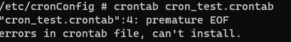
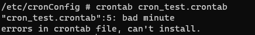
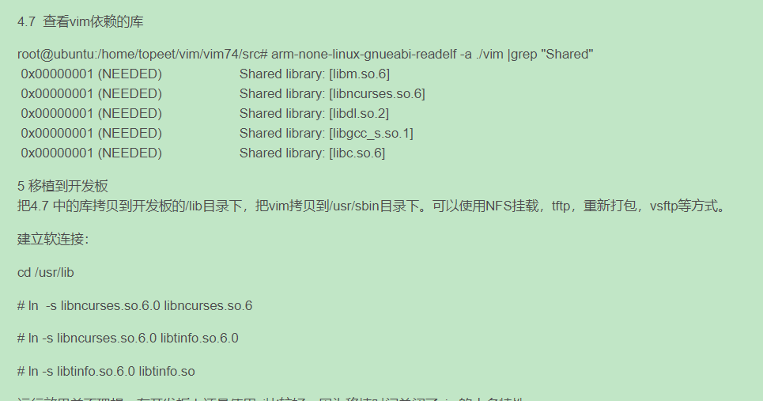

[TOC]

# cron_transplant

因为cron移植需要用到vim，而SDK中没有vi或者vim，故需要先移植vim到开发板上，在移植cron。

需求描述

1、裁剪cron 至20-30kb，集成到app。（目前为154kb）

2、app给参数cron，形如 {时间，任务名}，任务数组为{key,value}形式。cron根据key(任务名)执行value(任务，回调函数的形式)。

3、不用echo或者cat形式增删，直接传参。

## 移植vim

- 下载 [ncurses5.9](https://ftp.gnu.org/pub/gnu/ncurses/) 
- 下载 [vim7.4](ftp://ftp.vim.org/pub/vim/unix/)

### 1、**[编译ncurses](https://www.zhankr.net/87736.html)**

```shell
cd ncurses-5.9
./configure --prefix=/home/test/install_ncurses  --host=arm-linux --without-cxx --without-cxx-binding --without-ada --without-manpages --without-progs --without-tests --with-shared CC=/home/book/Desktop/opensdk_release/fib_tools/gcc-4.9.4_thumb_linux/usr/bin/arm-buildroot-linux-uclibcgnueabi-gcc
#编译并安装ncurses库
make && make install
#这样在/home/test/install_ncurses目录下就生成了ncurses的库和头文件等文件
bin  include  lib  share
#进入lib目录，创建littinfo的符号链接
cd lib
ln -s libncurses.so.5 libtinfo.so.5
ln -s libtinfo.so.5 libtinfo.so
```

### 2、**[编译vim](https://blog.csdn.net/feixiang3839/article/details/73772275)** 编译出来太大了，弃用

进入vim目录，并配置vim编译环境,其中CPPFLAGS指明了vim编译过程中需要用的libtifo库相关的头文件所在目录，同时LDFLAGS指明了libtinfo库所在的目录。[v3](https://www.lmlphp.com/user/58699/article/item/2240531/)

```shell
cd /home/liangwode/test/vim74
#v1 编译无法通过
./configure --with-features=tiny --disable-gui --without-x --disable-selinux --disable-acl --disable-gpm CPPFLAGS=-I/home/test/install_ncurses/include/ncurses LDFLAGS=-L/home/test/install_ncurses/lib LIBS="-ltinfo"
#v2 编译无法通过
./configure --host=arm-linux --prefix=/usr --disable-gui --without-x --disable-selinux --disable-acl --disable-gpm --with-tlib=ncurses CPPFLAGS=-I/home/test/install_ncurses/include/ncurses LDFLAGS=-L/home/test/install_ncurses/lib LIBS="-ltinfo"
#v3 编译通过
 #!/bin/sh
./configure --with-features=tiny --disable-gui \
--without-x --disable-selinux --disable-acl --disable-gpm \
CC=/home/book/Desktop/opensdk_release/fib_tools/gcc-4.9.4_thumb_linux/usr/bin/arm-buildroot-linux-uclibcgnueabi-gcc  \
--host=arm-none-linux-gnueabi \
--with-tlib=ncurses \
vim_cv_terminfo=yes \
vim_cv_getcwd_broken=no \
vim_cv_memmove_handles_overlap=yes \
vim_cv_stat_ignores_slash=yes \
vim_cv_tgetent=zero \
vim_cv_terminfo=yes \
vim_cv_toupper_broken=no \
vim_cv_tty_group=root \
vim_cv_tty_mode=0620
--with-tlib=ncurses \
CPPFLAGS=-I/home/test/install_ncurses/include/ncurses LDFLAGS=-L/home/test/install_ncurses/lib LIBS=-ltinfo

#开始编译
make

#这个make install 不了。
#在  src  里面能找到 vim
#将vim  放到目标文件的 usr/sbin/  里面，替换原来的  vim
#将 ncurses  的库放在 usr/lib 里面。
sudo /home/book/Desktop/opensdk_release/fib_tools/gcc-4.9.4_thumb_linux/usr/bin/arm-buildroot-linux-uclibcgnueabi-strip libncurses.so.5
#在目标文件系统里面  etc/profile 里面加入
export TERM="xterm"
#不然会报  E437: terminal capability "cm" required  错误
```


### 3、[cron移植](https://blog.csdn.net/yanlutian/article/details/82704944?ops_request_misc=%257B%2522request%255Fid%2522%253A%2522169381705516800222831904%2522%252C%2522scm%2522%253A%252220140713.130102334.pc%255Fall.%2522%257D&request_id=169381705516800222831904&biz_id=0&spm=1018.2226.3001.4187)

```shell
adb pull /etc/rc E:\vmwareWork\cron_work\cron_transplant\cron_source\pull

adb push E:\vmwareWork\cron_work\cron_transplant\cron_source\pull\rc /etc
adb shell chmod 777 /etc/rc
adb shell mkdir -p /etc/cronConfig 

cd /etc/cronConfig 
crontab cron_test.crontab

make CC=/home/book/Desktop/opensdk_release/fib_tools/gcc-4.9.4_thumb_linux/usr/bin/arm-buildroot-linux-uclibcgnueabi-gcc LDFLAGS=-static

make CC=/home/book/Desktop/opensdk_release/fib_tools/gcc-4.9.4_thumb_linux/usr/bin/arm-buildroot-linux-uclibcgnueabi-gcc AR=/home/book/Desktop/opensdk_release/fib_tools/gcc-4.9.4_thumb_linux/usr/bin/arm-buildroot-linux-uclibcgnueabi-ar
```

拷贝到开发板上报错，[解决方法](https://blog.csdn.net/weixin_33858249/article/details/92355642)



再次执行，提示时间格式错误



```
#write out current crontab
crontab -l > mycron
#echo new cron into cron file
echo "* * * * * /etc/cronConfig/cron_test.sh" >> mycron
#install new cron file
crontab mycron
rm mycron
```

修改默认编辑器

https://blog.csdn.net/KimBing/article/details/128469397


看这篇

https://blog.csdn.net/qq2586699366/article/details/122269570


