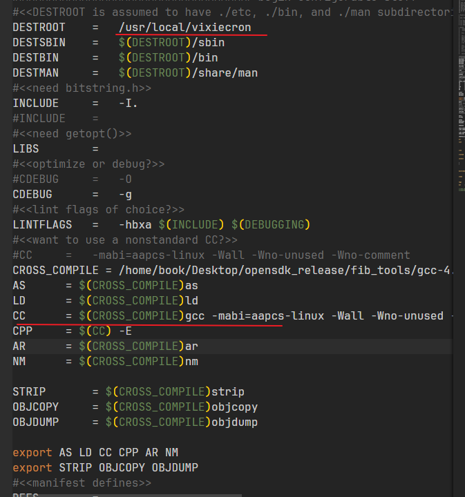
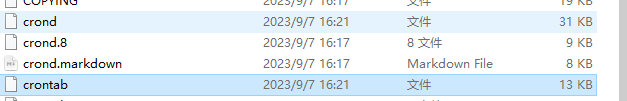
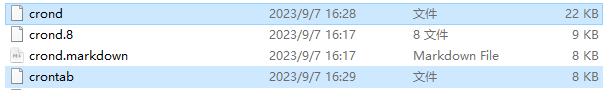
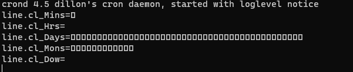
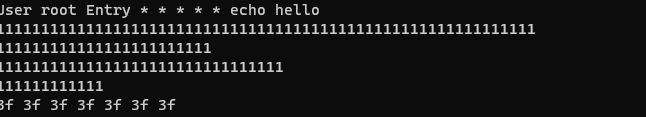
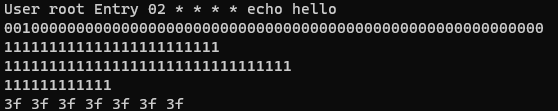

[TOC]


## 1.cron移植[^1]

### 需求描述

1、裁剪cron 至20-30kb，集成到app。（目前为154kb）

2、app给参数cron，形如 {时间，任务名}，任务数组为{key,value}形式。cron根据key(任务名)执行value(任务，回调函数的形式)。

3、不用echo或者cat形式增删，直接传参。

```
[
  { "cronTemplate": "0 0/3 * * * ?", "operation": "heartbeat" },
  { "cronTemplate": "0 0/5 * * * ?", "operation": "gwstatus" },
  { "cronTemplate": "0 0/30 * * * ?", "operation": "gatewayevents" },
  { "cronTemplate": "0 0/30 * * * ?", "operation": "waterenergy" },
  { "cronTemplate": "0 0/10 * * * ?", "operation": "wateralarms" },
  { "cronTemplate": "0 0/10 * * * ?", "operation": "waterevents" },
  { "cronTemplate": "0 0/20 * * * ?", "operation": "waterbilling" },
  { "cronTemplate": "0 0/10 * * * ?", "operation": "alarms" },
  { "cronTemplate": "0 0 * * * ?", "operation": "events" },
  { "cronTemplate": "0 0/20 * * * ?", "operation": "energyprofile" },
  { "cronTemplate": "0 0/30 * * * ?", "operation": "instantaneousprofile" },
  { "cronTemplate": "0 0,25 * * * ?", "operation": "maxdemandprofile" },
  { "cronTemplate": "0 0 * * * ?", "operation": "loadprofile1" },
  { "cronTemplate": "0 0 * * * ?", "operation": "loadprofile2" },
  { "cronTemplate": "0 0 * * * ?", "operation": "powerqualityprofile" },
  { "cronTemplate": "0 0 * * * ?", "operation": "instrumentationprofile" },
  { "cronTemplate": "0 1 * * * ?", "operation": "billingprofile" },
  { "cronTemplate": "0 0 * * * ?", "operation": "InstantaneousSave" },
  { "cronTemplate": "0 0 * * * ?", "operation": "EnergySave" },
  { "cronTemplate": "0 0 0 * * ?", "operation": "MaxdemandSave" },
  { "cronTemplate": "0 0 2 * * ?", "operation": "WaterSave" }
]
```

cron下载地址：https://github.com/cvpcs/android_external_vixie-cron

修改makefilie 



```
sudo make
#复制cron和crontab到开发板/usr/bin目录下
```

测试用例位于`cron_transplant\cron_source\script_corn\files`，或者使用2节中是测试方法。

## 2、精简dcron测试

下载地址：https://github.com/dubiousjim/dcron

1.修改makefile，第五行

```shell
PREFIX = /home/book/my_work/dcron
```

2.make指定编译器

```shell
make CC=/home/book/Desktop/opensdk_release/fib_tools/gcc-4.9.4_thumb_linux/usr/bin/arm-buildroot-linux-uclibcgnueabi-gcc
```

3.压缩编译后的文件

压缩前：44kb



```shell
sudo /home/book/Desktop/opensdk_release/fib_tools/gcc-4.9.4_thumb_linux/usr/bin/arm-buildroot-linux-uclibcgnueabi-strip crond

sudo /home/book/Desktop/opensdk_release/fib_tools/gcc-4.9.4_thumb_linux/usr/bin/arm-buildroot-linux-uclibcgnueabi-strip crontab
```

压缩后：30kb



4.测试

```shell
#write out current crontab
crontab -l > mycron
#echo new cron into cron file
echo "* * * * * echo hello" >> mycron
echo "00 09 * * 1-5 echo hello" >> mycron
#install new cron file
crontab mycron
rm mycron

crond -f -d
crontab -d
```


```shell
echo "00 09 * * 1-5 echo hello" >> mycron
```



```shell
echo "0/2 * * * * echo hello2222" >> mycron
```



```shell
echo "*/2 * * * * echo hello" >> mycron
```



```shell
#修改rc文件后推送
adb push E:\vmwareWork\cron_work\cron_transplant\cron_source\pull\rc /etc
adb shell chmod 777 /etc/rc
adb shell mkdir -p /etc/cronConfig 
#将编译好的crond、crontab推到开发板上
adb push E:\vmwareWork\cron_work\cron_transplant\reference_code\dcron\crond /bin
adb push E:\vmwareWork\cron_work\cron_transplant\reference_code\dcron\crontab /bin
adb shell chmod 777 /bin/crond
adb shell chmod 777 /bin/crontab
#启动cron
crond
#测试  
cd /etc/cronConfig/
#任务文件 cron_test.crontab
SHELL=/bin/sh
PATH=/sbin:/bin:/usr/bin:/usr/sbin
HOME=/
* * * * * /etc/cronConfig/cron_test.sh
#执行文件 cron_test.sh
#!/bin/sh
d=$(date)
cd /etc/cronConfig
touch "$d"
#推到开发板并赋权
adb push E:\vmwareWork\cron_work\cron_transplant\cron_source\script_corn\files\cron_test.crontab /etc/cronConfig
adb push E:\vmwareWork\cron_work\cron_transplant\cron_source\script_corn\files\cron_test.sh /etc/cronConfig
adb shell chmod 777 /etc/cronConfig/cron_test.crontab
adb shell chmod 777 /etc/cronConfig/cron_test.sh
#安装任务
crontab cron_test.crontab
#查看任务列表
crontab -l
#然后每分钟会新建一个以日期为名称的文件
#删除任务列表
crontab -d
```

测试结果：功能正常，满足项目开发需求。

```
echo "01 * * * * echo hello" >> mycron


```


## 3 cron与app整合

3.1、仔细阅读dcron源码，与项目需求进行结合。

```shell
#crond用到的.c文件
main.c 
subs.c 
database.c 
job.c 
concat.c  --
chuser.c
#crontab用到的.c文件
crontab.c 
chuser.c
```

3.2、将dron整合到app项目中


## 2.2 [supertinycron](https://github.com/exander77/supertinycron)测试

```shell
sudo /home/book/Desktop/opensdk_release/fib_tools/gcc-4.9.4_thumb_linux/usr/bin/arm-buildroot-linux-uclibcgnueabi-strip supertinycron

adb push E:\vmwareWork\cron_work\cron_transplant\makefile_debug\supertinycron\supertinycron /bin
adb shell chmod 777 /bin/supertinycron
supertinycron '* * * * * * *' /bin/echo hello

adb push E:\vmwareWork\snmp_work\opensdk_release\app_demo\lightWeightCron\Object\tinyCron /bin
adb shell chmod 777 /bin/tinyCron
tinyCron '* * * * * * *' /bin/echo hello


```


```makefile
#makefile加这一行
CFLAGS + = -Wextra -std=c89 -s -Os -ffunction-sections -fdata-sections -Wl,--gc-sections -Wl,-z,norelro -static -DVERSION=\"$(VERSION)\" -DCRON_USE_LOCAL_TIME
```


## 参考文章：

[^1]: https://blog.csdn.net/yanlutian/article/details/82704944?ops_request_misc=%257B%2522request%255Fid%2522%253A%2522169381705516800222831904%2522%252C%2522scm%2522%253A%252220140713.130102334.pc%255Fall.%2522%257D&request_id=169381705516800222831904&biz_id=0&spm=1018.2226.3001.4187
[^2]: https://blog.csdn.net/m0_38012470/article/details/103730471
[^3]: https://blog.csdn.net/m0_64560763/article/details/126309501
[^4]: https://blog.csdn.net/xiezhaoxuan/article/details/73161047