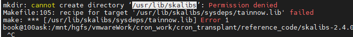

[TOC]


## 1.cron移植[^1]

### 需求描述

1、裁剪cron 至20-30kb，集成到app。（目前为154kb）

2、app给参数cron，形如 {时间，任务名}，任务数组为{key,value}形式。cron根据key(任务名)执行value(任务，回调函数的形式)。

3、不用echo或者cat形式增删，直接传参。


cron下载地址：https://github.com/cvpcs/android_external_vixie-cron

修改makefilie 


```
sudo make
#复制cron和crontab到开发板/usr/bin目录下
```

测试用例位于`cron_transplant\cron_source\script_corn\files`，或者使用2.1节中是测试方法。

## 2、dcron测试

下载地址：https://github.com/dubiousjim/dcron

1.修改makefile，第五行

```shell
PREFIX = /home/book/my_work/dcron
```

2.make指定编译器

```shell
make CC=/home/book/Desktop/opensdk_release/fib_tools/gcc-4.9.4_thumb_linux/usr/bin/arm-buildroot-linux-uclibcgnueabi-gcc
```

3.压缩编译后的文件

压缩前：44kb


```shell
sudo /home/book/Desktop/opensdk_release/fib_tools/gcc-4.9.4_thumb_linux/usr/bin/arm-buildroot-linux-uclibcgnueabi-strip crond

sudo /home/book/Desktop/opensdk_release/fib_tools/gcc-4.9.4_thumb_linux/usr/bin/arm-buildroot-linux-uclibcgnueabi-strip crontab
```

压缩后：30kb


4.测试

```shell
#修改rc文件后推送
adb push E:\vmwareWork\cron_work\cron_transplant\cron_source\pull\rc /etc
adb shell chmod 777 /etc/rc
adb shell mkdir -p /etc/cronConfig 
#将编译好的crond、crontab推到开发板上
adb push E:\vmwareWork\cron_work\cron_transplant\reference_code\dcron\crond /bin
adb push E:\vmwareWork\cron_work\cron_transplant\reference_code\dcron\crontab /bin
adb shell chmod 777 /bin/crond
adb shell chmod 777 /bin/crontab
#启动cron
crond
#测试  
cd /etc/cronConfig/
#任务文件 cron_test.crontab
SHELL=/bin/sh
PATH=/sbin:/bin:/usr/bin:/usr/sbin
HOME=/
* * * * * /etc/cronConfig/cron_test.sh
#执行文件 cron_test.sh
#!/bin/sh
d=$(date)
cd /etc/cronConfig
touch "$d"
#推到开发板并赋权
adb push E:\vmwareWork\cron_work\cron_transplant\cron_source\script_corn\files\cron_test.crontab /etc/cronConfig
adb push E:\vmwareWork\cron_work\cron_transplant\cron_source\script_corn\files\cron_test.sh /etc/cronConfig
adb shell chmod 777 /etc/cronConfig/cron_test.crontab
adb shell chmod 777 /etc/cronConfig/cron_test.sh
#安装任务
crontab cron_test.crontab
#查看任务列表
crontab -l
#然后每分钟会新建一个以日期为名称的文件
#删除任务列表
crontab -d

```

3


## 2. [slicd测试](https://github.com/jjk-jacky/slicd/tree/master)

2.1安装skalibs 

-skalibs version 2.4.0.0 or later: http://skarnet.org/software/skalibs/

./configure && make && sudo make install



配置如下

```
./configure --host=arm-linux --target=/home/book/Desktop/opensdk_release/fib_tools/gcc-4.9.4_thumb_linux/usr/bin/arm-buildroot-linux-uclibcgnueabi-cc
```

配置参数如下：

```shell


./configure --enable-cross=/home/book/Desktop/opensdk_release/fib_tools/gcc-4.9.4_thumb_linux/usr/bin/arm-buildroot-linux-uclibcgnueabi- --host=arm-linux --prefix=/home/book/my_work/slicd_test --with-sysdeps=/mnt/hgfs/vmwareWork/cron_work/cron_transplant/reference_code/skalibs-2.4.0.0/src/include/skalibs --with-sysdeps=/mnt/hgfs/vmwareWork/cron_work/cron_transplant/reference_code/skalibs-2.4.0.0/sysdeps.cfg
```


## 2.裁剪cron

思路

- 直接裁剪cron工程量巨大，且难以保证稳定性，故考虑使用busbox精简后的cron。

难点

- 需要交cron从busbox中提取出来。

### 2.1 busbox-cron测试

方案，用busybox精简过的cron[^2]-[^3]

1. 交叉编译busybox，只保留cron，编译后114kb。抽离代码后会小很多，因为cron源文件编译出来才67kb。
2. 推到开发板上测试[^4]

```shell
#修改rc文件后推送
adb push E:\vmwareWork\cron_work\cron_transplant\cron_source\pull\rc /etc
adb shell chmod 777 /etc/rc
adb shell mkdir -p /etc/cronConfig 
#将编译好的busybox推到开发板上
adb push E:\vmwareWork\cron_work\cron_transplant\cron_source\pull\busybox /etc/cronConfig 
adb shell chmod 777 /etc/cronConfig/busybox
#使用方法
#1启动cron
/etc/cronConfig/busybox crond
#2创建目录
mkdir -p /var/spool/cron/crontabs
cd /var/spool/cron/crontabs
#3创建文件
touch root


#测试  
#任务文件 cron_test.crontab
SHELL=/bin/sh
PATH=/sbin:/bin:/usr/bin:/usr/sbin
HOME=/
* * * * * /etc/cronConfig/cron_test.sh
#执行文件 cron_test.sh
#!/bin/sh
d=$(date)
cd /etc/cronConfig
touch "$d"
#推到开发板并赋权
adb push E:\vmwareWork\cron_work\cron_transplant\cron_source\script_corn\files\cron_test.crontab /etc/cronConfig
adb push E:\vmwareWork\cron_work\cron_transplant\cron_source\script_corn\files\cron_test.sh /etc/cronConfig
adb shell chmod 777 /etc/cronConfig/cron_test.crontab
adb shell chmod 777 /etc/cronConfig/cron_test.sh
#安装任务
cd /etc/cronConfig/
/etc/cronConfig/busybox crontab cron_test.crontab
#然后每分钟会新建一个以日期为名称的文件


/etc/cronConfig/busybox crond -c/etc/cronConfig
/etc/cronConfig/busybox crontab -l
/etc/cronConfig/busybox crontab -e
```

经测试移植后的cron正常运行。

### 2.2 从busbox中提取cron

- [提取方案参见](https://download.csdn.net/download/yingqiyi/10563433)，文件位于`cron_transplant/reference_code/tftp_src`

- [源码分析参见](http://119.91.213.182/#/dl?cdk=U0p1OTC3yGj3m)

1. src提取
2. include提取
3. makefile编写
4. 测试

### 2.3 将cron集成到app中

## 参考文章：

[^1]: https://blog.csdn.net/yanlutian/article/details/82704944?ops_request_misc=%257B%2522request%255Fid%2522%253A%2522169381705516800222831904%2522%252C%2522scm%2522%253A%252220140713.130102334.pc%255Fall.%2522%257D&request_id=169381705516800222831904&biz_id=0&spm=1018.2226.3001.4187
[^2]: https://blog.csdn.net/m0_38012470/article/details/103730471
[^3]: https://blog.csdn.net/m0_64560763/article/details/126309501
[^4]: https://blog.csdn.net/xiezhaoxuan/article/details/73161047